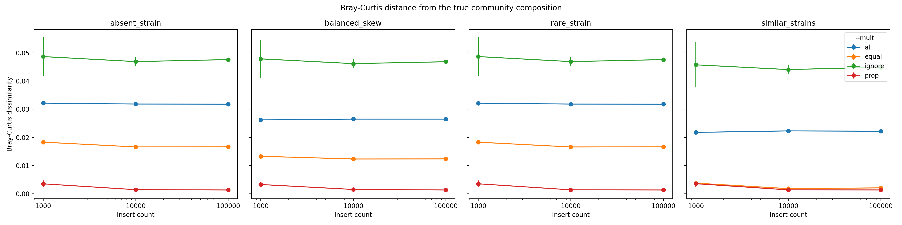
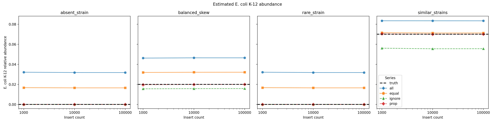
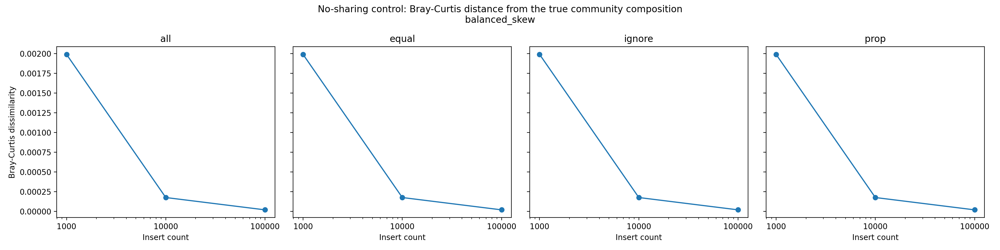

# msamtools profile validation

> **Generated automatically by `validation/validate_profiles.py`. Do not edit numerical results manually.**

- **msamtools version:** `1.2.0`
- **Git commit:** `b21ac461a56b6630290c82266477699afbba545c`
- **Validation date:** 2026-09-01

## Validation design

- 11 complete bacterial chromosome references
- Main communities: `absent_strain`, `balanced_skew`, `rare_strain`, `similar_strains`
- Insert counts: 1,000; 10,000; 100,000
- RNG seeds: 13579, 24680, 97531
- Multi-mapper modes: `all`, `equal`, `ignore`, `prop`
- Main shared-locus target fraction: 0.2
- Main multimapping simulations: 36
- Strict no-sharing controls: 9
- Relative-abundance profile evaluations: 180
- Additional exact-count profile evaluations: 36

The strict no-sharing control excludes both cross-genome multimappers and within-genome repeated loci.

## Exact recovery without ambiguous mapping

**PASS**

- Exact per-reference insert recovery: **PASS**
- Maximum insert-count error: **0**
- All `--multi` modes produced identical counts: **PASS**

With ambiguous mappings excluded, `msamtools profile --unit=ab --nolen` recovered the exact simulated source insert count for every profiled reference under every multi-mapper mode.

## Composition recovery with multimapping

Bray-Curtis dissimilarity was calculated between each estimated relative-abundance profile and its known generating composition.

| `--multi` mode | Mean Bray-Curtis | Maximum Bray-Curtis |
|---|---:|---:|
| `all` | 0.028085 | 0.032308 |
| `equal` | 0.012417 | 0.018916 |
| `ignore` | 0.046818 | 0.055698 |
| `prop` | 0.002109 | 0.004657 |

## Closely related strain stress tests

The two *Escherichia coli* reference strains provide a natural multi-mapping challenge in which one strain can be made rare or completely absent while the related strain remains abundant.

### Absent strain

- Community: `absent_strain`
- True *E. coli* K-12 relative abundance: **0**
- Maximum abundance estimated with proportional sharing: **0**
- False-positive abundance with proportional sharing: **none observed**

### Rare strain

- Community: `rare_strain`
- True *E. coli* K-12 relative abundance: **1.000e-05**
- Mean abundance estimated with proportional sharing: **4.115e-06**
- Maximum abundance estimated with proportional sharing: **1.235e-05**

## No-sharing control

In the strict no-sharing control, all profile modes recover the same exact insert counts. Relative-abundance estimates differ from the generating composition only through numerical normalization and output precision.

- Maximum Bray-Curtis distance from truth across all no-sharing runs and modes: **0.00199**

## Reproducibility

The validation workflow, genome manifest, community definitions, and simulation code are maintained under `validation/`. Detailed run-level TSV files are generated during validation and serve as machine-readable audit outputs; this Markdown file and the figures above are the release-facing summary.
